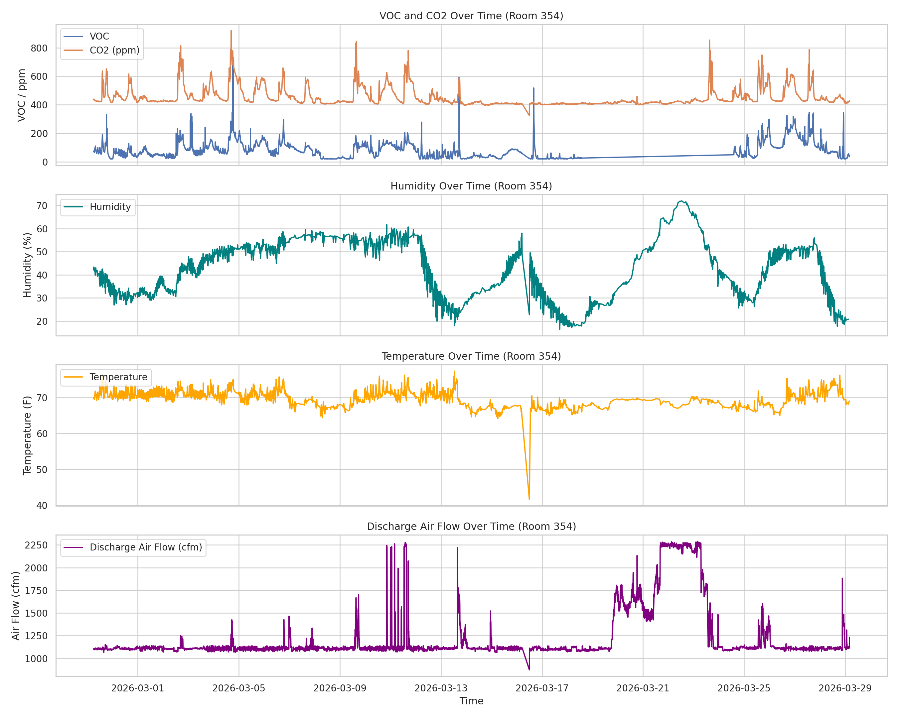
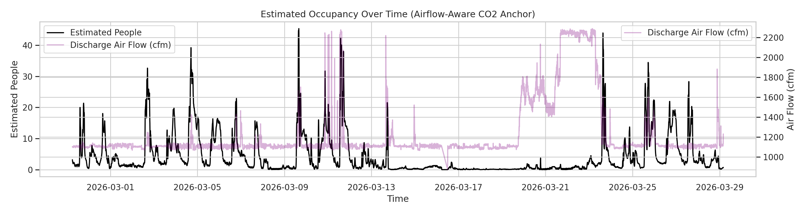

# Room 354 Occupancy Estimation Using VOC, CO2, Humidity, Temperature, and Airflow

Team Members: Samuel Hartmann, Fengjun Han, Garrett Green, Dalton Sloan

Domain Experts: Chandler Norman, Norman Walker, Elisabeth Humphrey, Dr. Steven Anton

## 1. Problem Statement

The original project plan focused on evaluating HVAC efficiency in the Ashraf Islam Engineering Building at Tennessee Tech. After exploratory analysis, the project focus was narrowed to Room 354 occupancy estimation using indoor air quality signals, with airflow used as a ventilation adjustment. The current notebook-based question is whether occupancy can be inferred from two 30-day Room 354 exports. The IAQ export contains VOC, CO2, humidity, and temperature measurements. The FPB export contains zone CO2, humidity, temperature, and discharge air flow.

This occupancy objective matters because occupancy-aware controls can reduce wasted HVAC runtime while still maintaining indoor air quality. If validated, a Room 354 occupancy model could support smarter building operation, reduced energy use during low-occupancy periods, and lower HVAC operating cost. For the current notebook phase, success is defined informally as: clear co-movement among occupancy-related signals, a plausible per-timestamp occupancy estimate, and a useful comparison between a simple airflow-adjusted CO2 baseline and the blended model.

## 2. Background and Related Work

This section is not required for CSC 4260, so the current report focuses on the direct data, methods, and findings from the Room 354 occupancy notebook.

TODO: Add a short background summary of occupancy detection using indoor air quality and activity signals only if the team decides it is needed for the final submission.

## 3. Data and Exploratory Analysis

The repository currently contains multiple building and room-level HVAC datasets, including:

- whole-building energy data,
- a Room 354 IAQ point-history export with CO2, VOC, noise, illuminance, humidity, and temperature fields,
- a Room 354 FPB point-history export with discharge air flow, zone CO2, humidity, and temperature fields,
- Room 361 data with carbon dioxide, humidity, and zone temperature fields,
- additional 361 HVAC data with discharge air temperature, zone temperature, zone carbon dioxide, airflow-related fields, and effective occupancy fields.

The two Room 354 files used in the current notebook are long-format point-history CSVs. Each record includes a UTC timestamp, a point name, a numeric value, and engineering units. The notebook filters the Room 354 points needed for occupancy estimation, pivots them into columns, and resamples them to 5-minute intervals.

Work already completed in the repository includes:

- collecting and organizing the available CSV files,
- preparing a workflow for loading HVAC data into a database,
- creating an initial notebook that plots whole-building energy consumption over time,
- creating an initial whole-building plot with a 24-hour moving average,
- creating an initial notebook that plots discharge air temperature and zone temperature for 361 data,
- creating a Room 354 notebook that merges IAQ and FPB sensors and compares VOC, CO2, humidity, temperature, and airflow over time,
- exporting Room 354 occupancy figures for the report.

Occupancy-focused exploratory plots currently supported by the Room 354 notebook include:

- a 4-panel time-series comparison of VOC/CO2, humidity, temperature, and discharge air flow,
- a separate estimated occupancy time series with airflow overlaid on a secondary axis.

TODO: Add notes from any domain expert conversations that have already happened.

The current Room 354 occupancy notebook covers sensor data from 2026-02-27 06:00 through 2026-03-29 04:05 after resampling to 5-minute intervals.

Within the notebook-derived Room 354 dataset, the exploratory feature levels were:

- VOC mean 83.43 with minimum 20.00, maximum 749.60, and P90 158.14,
- CO2 mean 453.37 ppm with minimum 324.42, maximum 920.54, and P90 552.51,
- humidity mean 41.85 percent with minimum 16.40, maximum 72.00, and P90 55.01,
- temperature mean 70.33 F with minimum 41.63, maximum 77.40, and P90 72.84,
- discharge air flow mean 1228.65 cfm with minimum 873.42, maximum 2288.79, and P90 1627.77,
- derived airflow rate mean 3.28 ACH with median 2.96 ACH, P95 5.88 ACH, and maximum 6.10 ACH.

The notebook does not currently impute missing humidity or temperature values. Instead, it preserves missing values from the original sensor streams and uses whatever signals are available at each time step. This avoids inventing occupancy evidence where no measurement was recorded. Humidity and temperature remain relatively sparse in the 30-day export, but discharge airflow is available in about 98 percent of the 5-minute bins, so it is useful for ventilation adjustment.

## 4. Methods and Tools

Methods and tools already reflected in the repository include:

- CSV-based HVAC and energy data collection,
- a database loading workflow for structured storage,
- notebook-based exploratory analysis,
- plotting and visualization of time-series sensor data,
- correlation analysis for IAQ feature relationships,
- rule-based occupancy estimation anchored to a CO2 mass-balance approximation,
- using discharge air flow to create a time-varying ACH estimate.

At this point, the completed work is still exploratory rather than final-model driven.

Cleaning steps currently implemented in the Room 354 notebook:

- parse the `dateTimeUtc` field from both Room 354 exports into a shared datetime format,
- coerce the long-format `value` field to numeric values,
- filter each export down to the Room 354 points needed for occupancy estimation,
- pivot the point-history tables from long format into room-level feature columns,
- resample both sources to 5-minute intervals,
- merge the IAQ and FPB streams on the shared time index,
- average overlapping CO2, humidity, and temperature readings across the two sources to create unified room-level signals,
- retain missing values where one source does not report so the notebook can still use partial information.

Feature engineering currently implemented in the Room 354 notebook:

- unified `co2` feature created from the IAQ and FPB CO2 streams,
- unified `humidity` and `temperature` features created from the available IAQ and FPB measurements,
- `airflow_cfm` extracted from the FPB `Discharge Air Flow` point,
- `airflow_ach` created by converting cfm to air changes per hour using the room volume,
- `ach_effective` created by using measured airflow-derived ACH when available and falling back to 4 ACH only when airflow is missing,
- robust min-max normalization of CO2, VOC, humidity, and temperature using the 5th and 95th percentiles,
- a CO2-anchor estimate based on room volume, outdoor CO2, measured effective ACH, and per-person generation,
- a weighted multi-feature occupancy index with CO2 as the strongest signal, VOC as the next strongest signal, and humidity/temperature as supporting features,
- a blended per-timestamp `people_estimated` signal using 70 percent airflow-aware CO2 anchor and 30 percent multi-feature scaling,
- 3-point rolling smoothing of the final occupancy estimate for presentation.

Current occupancy estimation assumptions used in exploratory analysis:

- room dimensions: 50 ft x 30 ft x 15 ft,
- room volume: approximately 637.1 m^3,
- outdoor CO2 baseline: 420 ppm,
- per-person CO2 generation: 0.018 m^3/h/person (light activity),
- discharge air flow is treated as a ventilation proxy and converted to ACH,
- baseline fallback ventilation scenario: 4 ACH only for intervals where airflow is missing.

Current exploratory modeling approach:

- use the merged Room 354 notebook dataset as the working analysis table,
- estimate occupancy continuously rather than assigning final labeled classes,
- use airflow to adjust the CO2 anchor rather than treating airflow as an independent occupancy trigger,
- treat the current output as a heuristic occupancy estimate rather than a validated final model because no ground-truth occupancy labels are available and discharge airflow is not the same as confirmed outdoor-air intake.

The current notebook uses Python with `pandas` for time parsing, reshaping, resampling, merging, and summary statistics; `matplotlib` and `seaborn` for plotting; and `numpy` for general numerical support. These tools were chosen because the problem is primarily time-series wrangling and exploratory visualization at this stage rather than large-scale model training.

Methods considered in the current notebook phase:

- direct visual comparison of VOC/CO2, humidity, temperature, and airflow,
- correlation analysis across the merged Room 354 features,
- a CO2-only occupancy anchor based on room volume and time-varying ventilation estimates,
- a blended multi-feature estimate that scales and combines CO2, VOC, humidity, and temperature,
- sensitivity checks against the older fixed-ACH assumption to see whether measured airflow changes the headcount estimate.

Methods not yet available in the current notebook:

- supervised classification or regression using labeled occupancy targets,
- validation against vibration data,
- validation against room schedule information, manual occupancy logs, or confirmed outdoor-air fraction / damper position data.

Methods tried but not retained as the primary estimate:

- airflow-only proxy: not adopted because discharge air flow is mainly a ventilation and dilution signal and showed weak direct correlation with both CO2 (-0.064) and the final occupancy estimate (-0.031),
- airflow as an extra weighted feature in the blended index: not adopted because airflow already enters the model through the effective ACH term, so weighting it again would double count HVAC operation,
- humidity-only proxy: not adopted because humidity behaved more like a slow background feature than a direct occupancy trigger,
- temperature-only proxy: not adopted because temperature was more stable than VOC and CO2 and produced a flatter response,
- unweighted multi-signal combination: not adopted because it over-smoothed the occupancy curve and muted peaks that still appear meaningful in the notebook plots.

TODO: Add any additional methods the team tried outside the Room 354 notebook if they will remain part of the final project narrative.

## 5. Results

The current Room 354 notebook merges IAQ and FPB sensor data from 2026-02-27 06:00 through 2026-03-29 04:05 at 5-minute intervals and compares VOC, CO2, humidity, temperature, and discharge airflow directly.

The 4-panel comparison indicates the following occupancy-related behavior:

- VOC vs CO2 Pearson correlation: 0.751 (strong positive),
- CO2 vs temperature Pearson correlation: 0.414 (moderate positive),
- VOC vs temperature Pearson correlation: 0.401 (moderate positive),
- humidity showed weaker direct relationships with the main occupancy features than VOC and CO2,
- discharge airflow had weak direct correlation with CO2 (-0.064) and VOC (0.172), which suggests it is more useful as a ventilation context signal than as a direct people-count proxy.

Additional airflow findings from the notebook:

- discharge airflow coverage is approximately 98.0 percent of the 5-minute bins,
- median discharge airflow is 1111 cfm, corresponding to a median effective ventilation rate of 2.96 ACH,
- the measured median ACH is below the earlier fixed 4 ACH assumption, so adding airflow lowers the central CO2-anchor estimate compared with the older fixed-ventilation approach.

Evaluation framing for this phase:

- no labeled occupancy ground truth is available yet, so accuracy-style metrics are not appropriate at this stage,
- the current baseline is the airflow-aware CO2 anchor estimate,
- the current primary model is the blended estimate that combines the airflow-aware CO2 anchor with VOC, humidity, and temperature,
- current evaluation is therefore descriptive: feature correlation, plot interpretation, and comparison of the baseline occupancy curve against the blended occupancy curve.

Using measured airflow instead of a fixed 4 ACH assumption changed the baseline. The mean CO2-anchor estimate dropped from 5.22 people under a fixed 4 ACH assumption to 4.17 people under the airflow-aware anchor, a reduction of about 20 percent.

The airflow-aware baseline CO2 anchor produced:

- mean estimate 4.17 people,
- P90 estimate 14.19 people,
- P95 estimate 19.16 people,
- P99 estimate 35.81 people,
- maximum estimate 70.64 people.

The blended occupancy estimate produced:

- mean estimated occupancy 4.22 people,
- P90 estimated occupancy 13.38 people,
- P95 estimated occupancy 17.88 people,
- P99 estimated occupancy 29.78 people,
- maximum estimated occupancy 46.00 people.

Formal quantitative comparison between the baseline and primary model:

- occupancy-curve standard deviation decreased from 7.61 in the airflow-aware baseline to 6.40 in the blended model, a 15.9 percent reduction in volatility,
- maximum estimated occupancy decreased from 70.64 to 46.00, a 34.9 percent peak reduction,
- P99 occupancy decreased from 35.81 to 29.78, a 16.8 percent reduction in the most extreme tail behavior,
- the number of 5-minute intervals above 30 estimated people decreased from 150 in the baseline to 85 in the blended model, a 43.3 percent reduction in extreme spikes.

Interpretation of the notebook plots:

- CO2 and VOC show the clearest shared peaks and remain the strongest occupancy indicators in the current data,
- discharge airflow is not a strong standalone occupancy trigger, but it improves the model by adjusting the CO2 anchor for changing ventilation rates,
- humidity changes more gradually over longer periods and appears more useful as a supporting feature than as a primary occupancy trigger,
- temperature remains comparatively stable for most of the study period and is best treated as contextual support rather than a standalone occupancy signal,
- compared with the airflow-aware CO2-only baseline, the blended estimate preserves major peaks while reducing some of the largest spikes,
- the largest occupancy spikes should still be treated cautiously until vibration data, labels, or outdoor-air-fraction data are available for validation.

Results currently supported directly by the notebook visualizations:

- the Room 354 notebook now includes a 4-panel comparison of VOC/CO2, humidity, temperature, and discharge air flow,
- the notebook also includes an estimated occupancy graph with airflow overlaid so the inferred people-count trend can be interpreted together with ventilation changes.

In the current Room 354 notebook, the strongest evidence for occupancy detection is the repeated joint rise of VOC and CO2 together with the more plausible airflow-adjusted CO2 anchor. These comparisons do not replace labeled accuracy metrics, but they do provide a reasonable basis for preferring the blended airflow-aware estimate over the simpler baseline in the current exploratory phase.

TODO: Add validated performance metrics once vibration data or labeled occupancy windows are available.

## 6. Conclusions and Future Work

The current Room 354 occupancy notebook shows that CO2 and VOC are still the strongest occupancy indicators in the available indoor air quality data, but airflow improves the model by replacing a fixed ventilation assumption with a time-varying ventilation proxy. The blended model produces an interpretable occupancy estimate over time and performs better than the airflow-aware CO2 baseline on several label-free metrics, including lower volatility and fewer extreme spikes. The strongest limitation is that no ground-truth occupancy labels are available and discharge airflow is only a proxy for true ventilation effectiveness, so the result should still be treated as a heuristic occupancy estimate rather than a validated headcount model.

If this approach is validated with additional signals, it could support smart-building control strategies that reduce unnecessary HVAC runtime, improve room-level energy efficiency, and lower operating cost during low-occupancy periods. The immediate next step is to integrate TDMS vibration data and stronger validation evidence so the current estimate can be tested against more credible occupancy information.

The next steps are to strengthen the estimate with additional evidence and validation:

- integrate TDMS vibration data and align it to the same 5-minute time index used for the Room 354 notebook,
- obtain room schedule windows, manual occupancy labels, or other headcount references so the baseline and blended models can be compared more formally,
- replace or refine the discharge-air proxy with outdoor-air fraction, damper position, or related AHU data if those signals become available,
- convert the current continuous heuristic estimate into low, medium, and high occupancy classes if that representation is more useful for the final deliverable.

TODO: Refine this section once validation data has been added so the final conclusion can summarize actual measured performance rather than exploratory plausibility.

## 7. Appendix

Repository and reproducibility references:

- GitHub repository: https://github.com/DaltonSloan/CSC_4260_project
- Room 354 occupancy notebook: https://github.com/DaltonSloan/CSC_4260_project/blob/visuals/room354_occupancy_visualization.ipynb
- Report source: https://github.com/DaltonSloan/CSC_4260_project/blob/visuals/reports/updated_project_report.md
- Room 354 IAQ source data: https://github.com/DaltonSloan/CSC_4260_project/blob/visuals/data/354_IAQ_30day%2803-28-2026%29.csv
- Room 354 FPB source data: https://github.com/DaltonSloan/CSC_4260_project/blob/visuals/data/354_FPB_30day%2803-28-2026%29.csv

Current reproducibility notes:

- the notebook is contained in the same repository as the data and report source,
- the current figures and statistics can be regenerated from the Room 354 notebook or the report build script using the tracked IAQ and FPB CSV files,
- the PDF report rebuilds the Room 354 figures directly from the same current analysis logic.

TODO: Verify that the `visuals` branch links above remain publicly accessible at final submission time, or replace them with the final merged branch links.

TODO: Add any required team contribution breakdown or communication notes here if the instructor expects them inside the report rather than only in the repository documentation.
