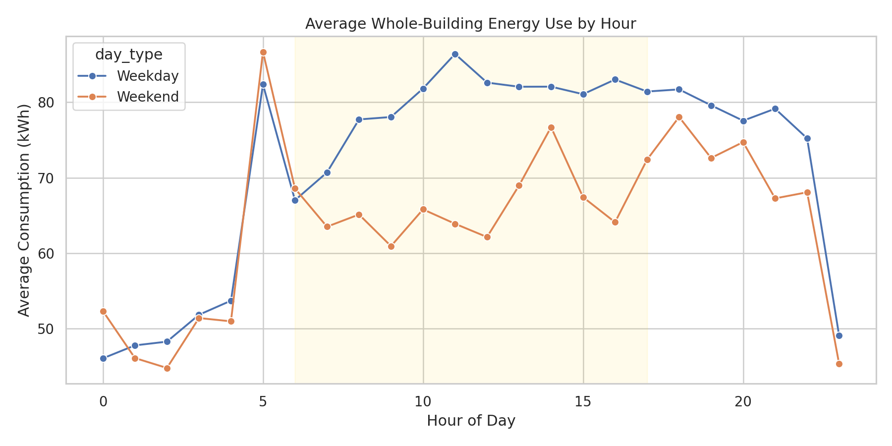
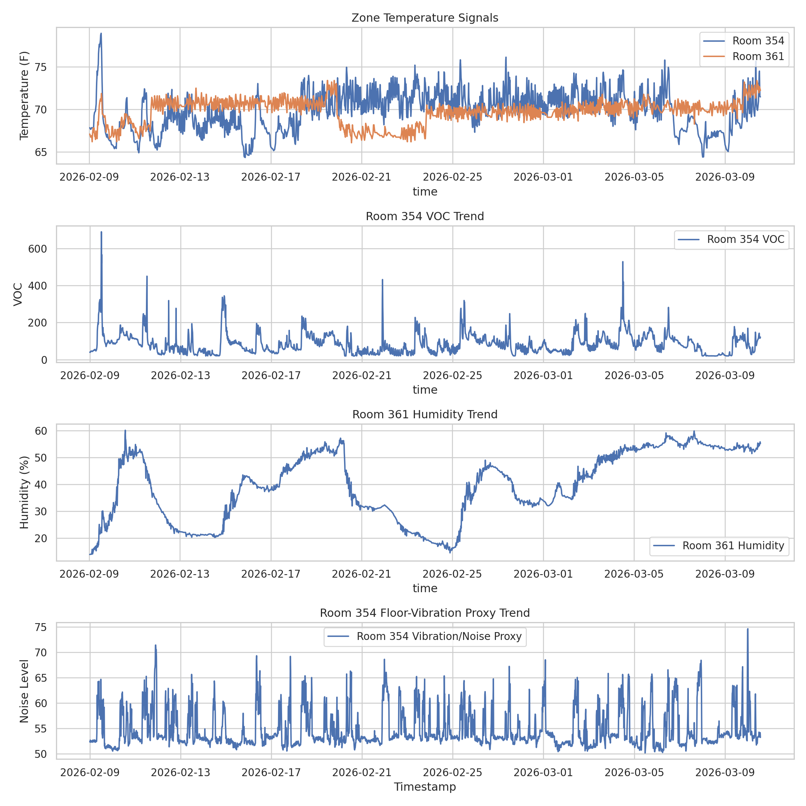
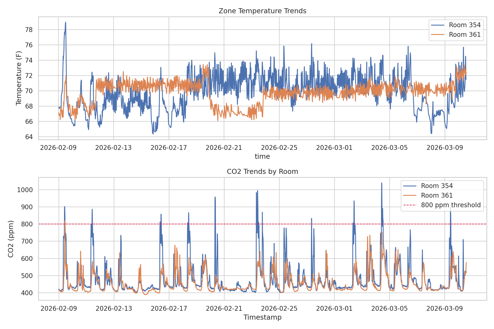
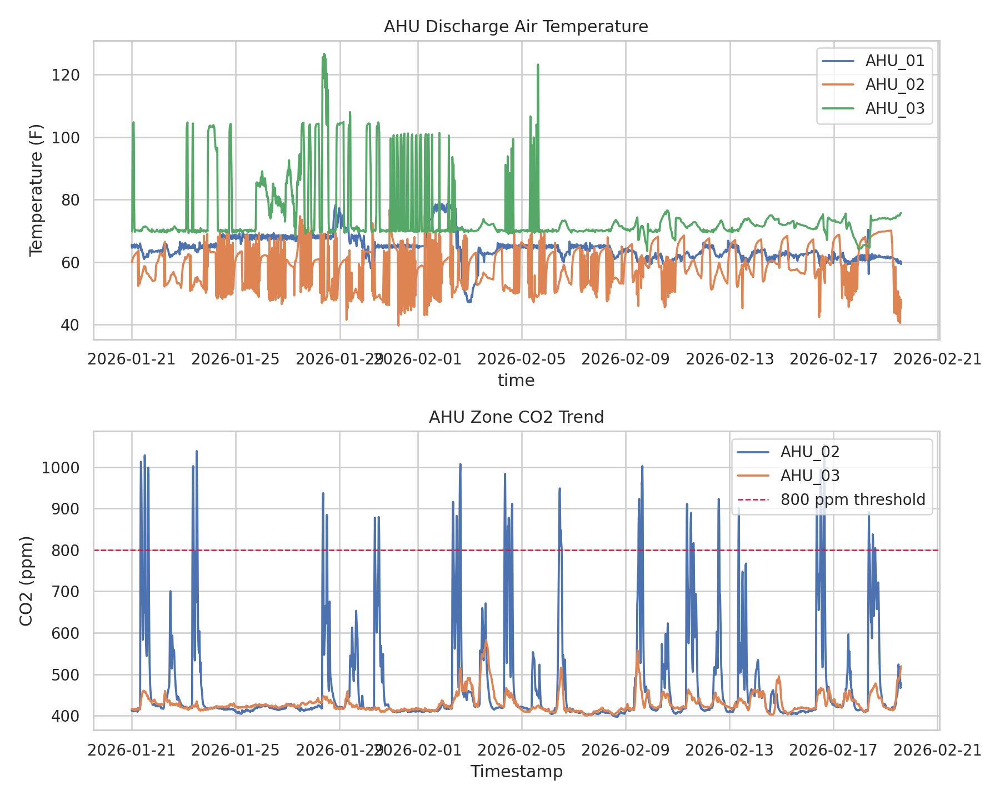

# Occupancy Detection in the Ashraf Islam Engineering Building (AIEB)

Team Members: Samuel Hartmann, Fengjun Han, Garrett Green, Dalton Sloan

Domain Experts: Chandler Norman, Norman Walker, Elisabeth Humphrey, Dr. Steven Anton

## 1. Problem Statement

After the initial exploratory data analysis, the project objective was revised. Instead of treating the project as a broad HVAC efficiency study, the team is now focusing on determining room occupancy from indoor sensor behavior. The current working feature set is:

- VOC
- temperature
- humidity
- floor-vibration-related activity

In the current data exports, the floor-vibration idea is represented most closely by the available noise-level signal in Room 354, so this draft treats that measurement as the current activity proxy. This revision was made after the exploratory analysis showed that the room-level signals provide a more direct and efficient path to occupancy inference than trying to evaluate overall HVAC efficiency from mixed building-level and AHU-level data alone.

The data comes from the AIEB building automation and sensor infrastructure. The repository currently includes whole-building electric consumption, AHU telemetry for three air-handling units, and room-level sensor feeds for Rooms 354 and 361.

The room-level feeds are the most important inputs for the revised objective:

- Room 354 includes carbon dioxide, VOC, noise level, and zone temperature.
- Room 361 includes carbon dioxide, zone air humidity, and zone temperature.

That means the current dataset does not yet place all four target occupancy features in one room export at the same time. This update therefore documents the occupancy pivot, validates the usefulness of the candidate sensor signals, and sets up the next phase where those signals can be aligned into one modeling table.

At this stage of the project, success is measured by whether the exploratory analysis supports the revised objective. Informal success measures for this draft are:

- show that room-level sensor patterns shift between work hours and off hours,
- show that VOC, humidity, temperature, and the activity proxy are stable enough to use in later modeling,
- keep the earlier whole-building and AHU analysis as supporting context rather than the final target,
- preserve a clear and reproducible workflow that can be extended into an occupancy model later in the semester.

## 2. Data and Exploratory Analysis

The source data is heterogeneous and sparse by design. Many rows contain only one or two active measurements while the remaining columns are blank. For that reason, the first analytical task was to normalize timestamps and aggregate the data into consistent 15-minute intervals before comparing rooms or operating periods.

The main preparation steps were:

- remove non-data metadata rows from the whole-building energy export,
- convert all timestamps into a consistent datetime format,
- resample room and AHU measurements into 15-minute averages to align asynchronous sensor updates,
- preserve measurement-specific missing values instead of dropping full rows,
- label observations by hour of day, work hours, and weekday versus weekend.

The exploratory analysis changed the project direction in a useful way:

- whole-building energy clearly rises during daytime hours, so occupancy-linked demand is visible at the building level,
- Room 354 shows stronger variation than Room 361, especially in VOC, carbon dioxide, and temperature,
- Room 361 contributes the humidity signal that is directly relevant to the revised occupancy objective,
- AHU data still helps explain building behavior, but it is less direct than room sensors for identifying whether a space is occupied.

Based on those findings, the team concluded that occupancy detection is a better and more efficient final objective than a broad HVAC-efficiency score.

## 3. Methods and Tools

This updated report focuses on descriptive analytics that justify the revised project objective. The current workflow is designed to answer a practical question first: do the available room-level signals behave in a way that makes occupancy modeling reasonable?

Methods used in this draft:

- time-series alignment through timestamp parsing and 15-minute resampling,
- operational segmentation by work hours versus off hours,
- weekday versus weekend comparison for building-level energy demand,
- room-level descriptive statistics for VOC, humidity, temperature, activity proxy, and carbon dioxide where available,
- AHU-level descriptive statistics retained as supporting building-operation context,
- comparison of work-hour versus off-hour means to identify sensor shifts that are consistent with occupied conditions.

Tools used in this draft:

- spreadsheet-style data cleaning and tabular analysis,
- figure generation for time-series comparisons,
- notebook-based documentation for the analysis workflow,
- a reproducible project workflow so the same summaries and figures can be rebuilt from the current exports.

The current baseline is not yet a final occupancy classifier. Instead, it is an occupancy-oriented feature-screening workflow:

- whole-building energy and AHU patterns provide context for when activity is likely higher,
- Room 354 is used to examine VOC, temperature, and the activity proxy,
- Room 361 is used to examine humidity and temperature,
- carbon dioxide is retained as a supporting comparison signal because it still responds to occupancy-related activity, even though it is no longer the main project objective.

This baseline is appropriate for the current phase because the team is still aligning the available room streams and selecting the final occupancy target definition.

## 4. Preliminary Results

### Why the Objective Changed

The earlier efficiency review still produced useful evidence:

- average whole-building consumption during working hours was 74.81 kWh, compared with 62.47 kWh during off hours,
- average weekday consumption was 71.34 kWh, compared with 64.07 kWh on the weekend,
- the highest observed hourly consumption was 95.49 kWh at 4:00 p.m. on February 2, 2026,
- AHU 03 also showed a very high discharge-air-temperature maximum of 126.6 degrees Fahrenheit, which makes it interesting for operations review but not ideal as the main project target.

Those results confirmed that the building data is useful, but they also showed that direct occupancy inference should be built from the room sensors instead of from system-level efficiency metrics alone.

### Room-Level Occupancy Signals

The revised project objective is supported most strongly by the room-level signals:

- Room 354 VOC averaged 85.28, increased to 96.36 during working hours, dropped to 74.23 off hours, and reached a maximum of 689.21.
- Room 354 noise level averaged 54.73, with a working-hours mean of 55.21, an off-hours mean of 54.25, and a maximum of 74.62.
- Room 354 temperature averaged 70.29 degrees Fahrenheit, with a working-hours mean of 70.93, an off-hours mean of 69.66, and a maximum of 78.95.
- Room 361 humidity averaged 40.29 percent, with a working-hours mean of 40.79, an off-hours mean of 39.69, and a maximum of 60.07.
- Room 361 temperature averaged 69.83 degrees Fahrenheit, with a working-hours mean of 69.90, an off-hours mean of 69.77, and a maximum of 73.40.

These signals are not identical in strength, but they are directionally useful. VOC and temperature in Room 354 move more clearly with building activity, while Room 361 contributes the humidity signal that the revised objective needs. The noise-level channel in Room 354 is modest but still useful as a first activity proxy for the floor-vibration concept described in the revised objective.

Carbon dioxide remains a helpful comparison signal:

- Room 354 had an average carbon dioxide level of 480.27 parts per million, with 1.84 percent of 15-minute intervals above 800 parts per million.
- Room 361 had an average carbon dioxide level of 455.57 parts per million, with only 0.04 percent of intervals above 800 parts per million.

That contrast supports the idea that Room 354 is the better candidate for early occupancy-pattern analysis.

### Supporting Building Context

The earlier room and AHU figures still matter because they explain why the project moved away from broad efficiency scoring:

- Room 354 is consistently more variable than Room 361,
- AHU behavior differs substantially across units, which is important operationally but harder to map directly to room occupancy,
- building-level energy confirms day-versus-night behavior, but it is too coarse to serve as the main occupancy feature set by itself.

### Interpretation

Taken together, these results support the revised project direction:

- the exploratory analysis justified changing the objective from broad HVAC efficiency review to occupancy detection,
- room-level environmental signals are more direct and efficient for occupancy work than whole-building or AHU-only summaries,
- the current project files already contain the right kinds of signals, but they still need to be aligned into one consistent occupancy-modeling dataset,
- Room 354 is the strongest immediate candidate for early occupancy experiments because it already contains VOC, temperature, carbon dioxide, and the current activity proxy.

## 5. Professionalism and Reproducibility

This update is organized so another team member can reproduce the draft results with minimal difficulty. The report, figures, summary tables, and notebook all reflect the same set of current data exports. The workflow is repeatable, and the project files are organized so the same analysis can be refreshed as new data becomes available.

The updated submission materials include the revised report, summary outputs, supporting figures, and notebook. Together, they provide a consistent record of the exploratory findings that led to the occupancy-detection objective.

Contribution tracking note:

- The repository history currently records the project under the names DaltonSloan and Dalton Sloan.
- The updated report and notebook workflow for this draft are centralized in the current project deliverables.
- If the final course submission requires a finer member-by-member breakdown, the team should replace this note with the agreed ownership summary before submitting the final report and poster.

## 6. Next Steps

This is still a preliminary-results draft, not the final project report. The next analytical steps should be:

- align the room-level streams so VOC, temperature, humidity, and the activity proxy can be used in one occupancy-modeling table,
- decide how occupancy will be labeled or approximated for training and evaluation,
- build a simple baseline occupancy model before moving to more advanced methods,
- keep whole-building energy and AHU signals as supporting context features rather than as the primary project target.
